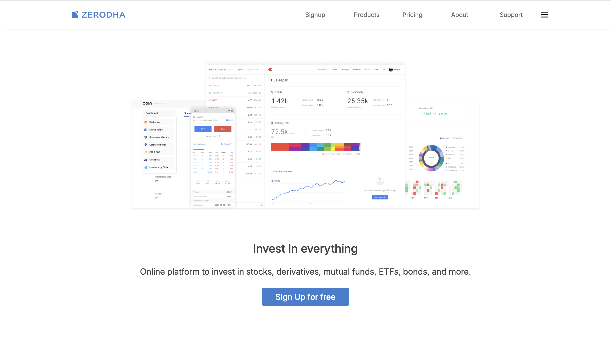

# Zerodha-UI-Clone

A simple Zerodha landing page UI clone built using HTML and CSS to practice layout, flexbox, and modern UI design. This project was created as a frontend practice project.

🚀 Features
⚪️ Zerodha-style landing page layout
⚪️ Clean and minimal UI design
⚪️ Flexbox-based layout
⚪️ Styled buttons and sections
⚪️ Responsive design basics
⚪️ Beginner-friendly frontend project

🛠️ Technologies Used
🟡 HTML5
🟡 CSS3
🟡 Flexbox

Project Structure 
Zerodha-UI-Clone
├── image/
├── .gitignore
├── Preview.png
├── README.md
├── Zerodha2.css
├── zeroda main.html
└── zerodha.css

